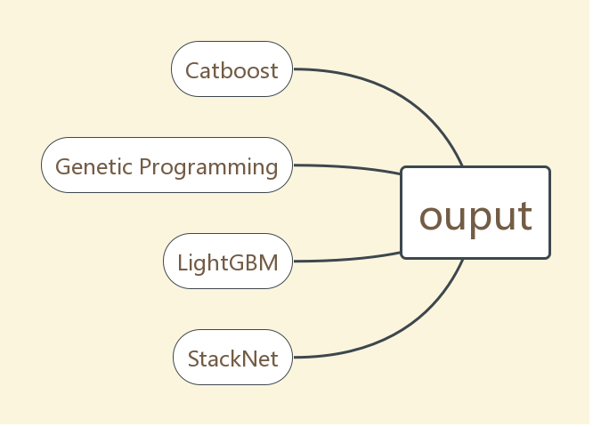
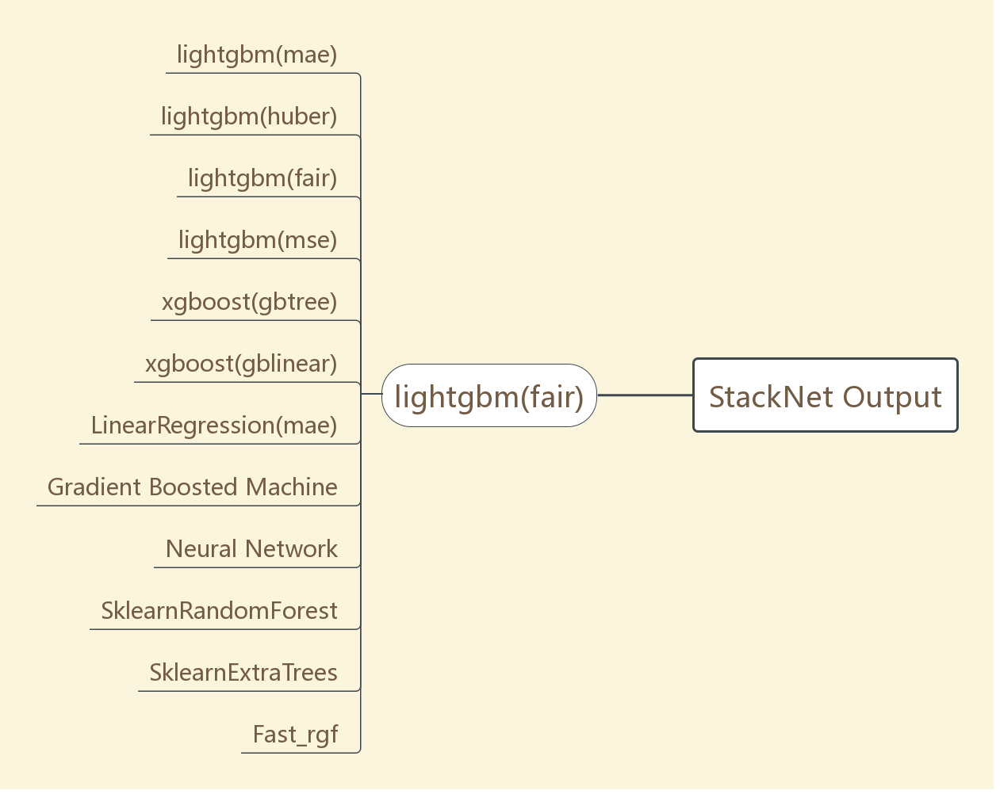

# Zillow-Prize
A repository of my code for the kaggle competition: [Zillow Prize](https://www.kaggle.com/c/zillow-prize-1)

### Leaderboard

180/3799 (Top 5%)

### Architecture

 

The final output is a weighted average of 4 models(Catboost, Genetic Programming, LightGBM, StackNet).
[StackNet](https://github.com/kaz-Anova/StackNet) is a great framework for ensembling models. For this competition, use 12 models for 5-fold stacking(level-2 model does not use level-1 model's features). 

### Some Thoughts and Tricks

* Kaggle community is very helpful. Learned a lot from shared kernels and discussion.
* Catboost seems to be the best single model for the competition.
* Feature engineering is important but I cannot come up with some "magic" features with combination of origin ones. Dropping some features is useful though.
* Choose different features for different models to increase the variety of models
* Ensemble as much irrelevent good models as possible. Tree-based models are suitable for kaggle competition, try different depth, loss, bagging strategy and etc. 
* Cut off outliers with high |logerror| 
 
